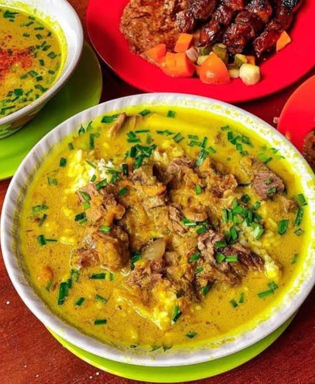

# 📖 Panduan Website Rasa Nusantara — Katalog Kuliner Cirebon

> Panduan ini ditulis khusus untuk kamu yang baru pertama kali menggunakan website ini.
> Tenang, tidak perlu paham coding! Ikuti langkah-langkahnya satu per satu.

---

## Daftar Isi

1. [Tentang Website Ini](#1-tentang-website-ini)
2. [Cara Membuka Website](#2-cara-membuka-website)
3. [Halaman-Halaman Website](#3-halaman-halaman-website)
4. [Fitur-Fitur Website](#4-fitur-fitur-website)
5. [Struktur File dan Folder](#5-struktur-file-dan-folder)
6. [Cara Ganti Gambar](#6-cara-ganti-gambar)
7. [Cara Tambah Data](#7-cara-tambah-data)
8. [Tips dan Catatan](#8-tips-dan-catatan)

---

## 1. Tentang Website Ini

**Rasa Nusantara** adalah sebuah website katalog kuliner khas Kota Cirebon. Website ini dibuat untuk menampilkan dan mendokumentasikan berbagai makanan dan minuman tradisional Cirebon yang lezat dan kaya budaya.

### Apa tujuan website ini?

- Menyajikan informasi kuliner khas Cirebon secara rapi dan mudah dibaca
- Menjadi referensi atau katalog digital bagi siapa saja yang ingin mengenal kuliner Cirebon
- Menampilkan 25 jenis kuliner lengkap dengan nama, kategori, harga, dan status ketersediaannya

### Tema dan tampilan

Website ini menggunakan tema **warna merah dan putih** yang hangat, mencerminkan keberanian dan kelezatan masakan Cirebon. Tampilannya modern, rapi, dan mudah digunakan.

---

## 2. Cara Membuka Website

Website ini adalah website **statis** — artinya tidak perlu koneksi internet dan tidak perlu server khusus. Cukup buka filenya langsung dari komputer kamu!

### Langkah 1 — Temukan folder website

Buka **File Explorer** di komputer kamu, lalu cari folder bernama:

```
rasa-nusantara-demo
```

Di dalam folder itu ada beberapa file, termasuk `index.html`.

### Langkah 2 — Buka file index.html

Klik kanan pada file `index.html`, lalu pilih:

- **"Open with"** → pilih browser yang kamu suka (Chrome, Firefox, Edge, dsb.)

Atau bisa juga klik dua kali langsung jika browser sudah jadi program default.

### Langkah 3 — Halaman Login akan muncul

Setelah file terbuka di browser, kamu akan melihat **halaman login**. Masukkan:

- **Username:** `admin`
- **Password:** `admin123`

Lalu klik tombol **"Masuk"**.

> ⚠️ Kalau username/password salah, akan muncul pesan error. Pastikan penulisannya tepat, huruf kecil semua.

### Langkah 4 — Jelajahi website

Setelah login berhasil, kamu akan diarahkan ke **halaman Dashboard**. Dari sana kamu bisa:

- Melihat ringkasan statistik kuliner
- Menelusuri katalog kuliner unggulan
- Membuka halaman **Data Master** untuk melihat tabel lengkap 25 kuliner

---

## 3. Halaman-Halaman Website

Website ini terdiri dari **3 halaman utama**:

---

### 🔐 Halaman Login (`index.html`)

Ini adalah halaman pertama yang muncul saat kamu membuka website. Fungsinya sebagai pintu masuk — kamu harus memasukkan username dan password dulu sebelum bisa masuk ke dalam.

**Yang ada di halaman ini:**
- Judul website "Rasa Nusantara"
- Kolom isian username
- Kolom isian password
- Tombol "Masuk"
- Pesan selamat datang singkat

---

### 🏠 Halaman Dashboard (`dashboard.html`)

Ini adalah halaman utama setelah login berhasil. Halaman ini seperti "beranda" dari website — menampilkan ringkasan dan sorotan kuliner.

**Yang ada di halaman ini:**
- Sidebar navigasi di sebelah kiri
- Kartu statistik (stat cards) di bagian atas
- Info strip / banner informasi
- Katalog unggulan berisi foto-foto kuliner pilihan

---

### 📋 Halaman Data Master (`data-master.html`)

Halaman ini menampilkan **tabel lengkap** berisi 25 data kuliner Cirebon. Di sini kamu bisa melihat semua informasi kuliner secara detail.

**Yang ada di halaman ini:**
- Sidebar navigasi (sama seperti dashboard)
- Tabel dengan 25 baris data kuliner
- Tombol Tambah, Edit, dan Hapus
- Fitur pagination (halaman data)
- Badge kategori warna-warni
- Status aktif/nonaktif tiap kuliner

---

## 4. Fitur-Fitur Website

Berikut penjelasan lengkap semua fitur yang ada di website ini:

---

### 🔑 Form Login

Form login adalah tempat kamu memasukkan **username** dan **password** untuk masuk ke website.

- Username: `admin`
- Password: `admin123`
- Kalau salah, muncul pesan error merah
- Kalau benar, langsung diarahkan ke Dashboard

---

### 📌 Sidebar Navigasi

Sidebar adalah **panel menu di sebelah kiri** layar yang selalu terlihat saat kamu berada di halaman Dashboard atau Data Master.

**Menu yang tersedia:**
- **Dashboard** — kembali ke halaman beranda
- **Data Master** — buka halaman tabel kuliner
- **Logout** — keluar dari website

Sidebar memudahkan kamu berpindah halaman tanpa harus tekan tombol "back" di browser.

---

### 📊 Stat Cards (Kartu Statistik)

Di bagian atas halaman Dashboard, ada beberapa **kotak kecil berwarna** yang menampilkan angka-angka penting, seperti:

- Jumlah total kuliner yang terdaftar
- Jumlah kuliner yang sedang aktif
- Jumlah kategori kuliner
- Informasi ringkas lainnya

Stat cards berguna sebagai **ringkasan cepat** kondisi data kuliner.

---

### 📢 Info Strip

Info strip adalah **banner atau baris informasi** yang biasanya muncul di bawah stat cards. Fungsinya untuk menampilkan pengumuman atau informasi menarik seputar kuliner Cirebon.

---

### 🍽️ Katalog Unggulan (dengan Foto)

Di halaman Dashboard, ada seksi **Katalog Unggulan** yang menampilkan kartu-kartu kuliner dengan foto asli. Setiap kartu berisi:

- Foto kuliner
- Nama makanan/minuman
- Kategori (misalnya: Makanan Berat, Jajanan, Minuman)
- Harga perkiraan

Kuliner yang ditampilkan di sini antara lain:
- 🍲 Empal Gentong
- 🍚 Nasi Jamblang
- 🥗 Lengko
- 🥣 Docang
- 🧆 Tahu Gejrot
- 🍜 Mie Koclok

---

### 📋 Tabel 25 Data Kuliner

Di halaman **Data Master**, ada tabel lengkap berisi **25 kuliner khas Cirebon**. Kolom-kolom dalam tabel ini meliputi:

| Kolom | Keterangan |
|---|---|
| No | Nomor urut |
| Nama Kuliner | Nama makanan/minuman |
| Kategori | Jenis kuliner (Makanan Berat, Jajanan, dll.) |
| Harga | Kisaran harga |
| Status | Aktif atau Tidak Aktif |
| Aksi | Tombol Edit dan Hapus |

---

### ➕ Tombol Tambah Data

Tombol **"Tambah"** biasanya ada di bagian atas tabel. Fungsinya untuk menambahkan baris kuliner baru ke dalam tabel.

> ℹ️ Karena ini website statis (tanpa database), menambah data dilakukan dengan **mengedit file HTML secara langsung**. Lihat bagian [Cara Tambah Data](#7-cara-tambah-data) untuk panduannya.

---

### ✏️ Tombol Edit

Tombol **"Edit"** ada di setiap baris tabel. Fungsinya untuk mengubah informasi kuliner yang sudah ada, seperti nama, harga, atau kategori.

> ℹ️ Sama seperti tambah data, edit data juga dilakukan lewat file HTML.

---

### 🗑️ Tombol Hapus

Tombol **"Hapus"** ada di setiap baris tabel. Fungsinya untuk menghapus data kuliner dari tabel.

> ⚠️ Hati-hati saat menggunakan tombol ini. Kalau di website statis, perubahan harus dilakukan di file HTML.

---

### 📄 Pagination

Kalau data di tabel terlalu banyak untuk ditampilkan sekaligus, **pagination** akan membagi data menjadi beberapa halaman. Kamu bisa klik nomor halaman atau tombol "Berikutnya" / "Sebelumnya" untuk berpindah halaman data.

---

### 🏷️ Badge Kategori

Setiap kuliner punya **badge** (label warna-warni kecil) yang menunjukkan kategorinya. Contoh:

- 🟠 **Makanan Berat** — untuk menu makan siang/malam
- 🟡 **Jajanan** — untuk camilan dan jajanan pasar
- 🔵 **Minuman** — untuk minuman khas
- 🟢 **Lainnya** — kategori lain

Badge ini memudahkan kamu langsung tahu jenis kulinernya hanya dengan melihat warnanya.

---

### ✅ Status Aktif / Nonaktif

Setiap kuliner punya kolom **Status** yang menunjukkan apakah kuliner itu sedang tersedia atau tidak:

- ✅ **Aktif** — kuliner ini sedang tersedia / bisa ditemukan
- ❌ **Tidak Aktif** — kuliner ini sedang tidak tersedia atau sedang dalam review

Status ini membantu pengelola katalog untuk memfilter data yang relevan.

---

### 🚪 Logout

Tombol **Logout** ada di sidebar navigasi bagian bawah. Klik tombol ini untuk **keluar dari website** dan kembali ke halaman login.

Ini penting kalau kamu menggunakan komputer umum dan tidak ingin orang lain mengakses website ini setelah kamu selesai.

---

## 5. Struktur File dan Folder

Berikut penjelasan semua file yang ada di folder website ini:

```
rasa-nusantara-demo/
│
├── index.html          ← Halaman login
├── dashboard.html      ← Halaman dashboard / beranda utama
├── data-master.html    ← Halaman tabel 25 data kuliner
│
├── style.css           ← Tampilan (warna, font, layout) untuk halaman login
├── dashboard.css       ← Tampilan untuk halaman dashboard dan data master
│
├── makanan.md          ← Catatan data informasi kuliner dalam format teks
│
├── guide.md            ← Panduan ini (file yang sedang kamu baca!)
│
└── assets/             ← Folder tempat menyimpan semua gambar
    ├── empal-gentong.jpeg
    ├── nasi-jamblang.jpeg
    ├── lengko.jpeg
    ├── docang.jpeg
    ├── tahu-gejrot.jpeg
    ├── mie-koclok.jpg
    ├── megamendung.png
    └── boled great.jpeg
```

### Penjelasan tiap file:

| File | Fungsi |
|---|---|
| `index.html` | Halaman pertama yang muncul — form login |
| `dashboard.html` | Beranda setelah login — statistik dan katalog foto |
| `data-master.html` | Tabel lengkap 25 kuliner Cirebon |
| `style.css` | Mengatur warna, font, dan tampilan halaman login |
| `dashboard.css` | Mengatur tampilan semua elemen di dashboard dan data master |
| `makanan.md` | File catatan berisi data kuliner dalam format teks biasa |
| `guide.md` | Panduan penggunaan website (file ini) |
| `assets/` | Folder khusus untuk gambar-gambar kuliner |

---

## 6. Cara Ganti Gambar

Mau ganti foto kuliner dengan foto yang lebih bagus atau lebih baru? Ikuti langkah berikut:

### Langkah 1 — Siapkan foto baru

- Pastikan foto dalam format **JPEG, JPG, atau PNG**
- Ukuran foto yang disarankan: **lebar 400px ke atas** agar tidak buram
- Nama file tidak boleh menggunakan spasi — gunakan tanda hubung ( `-` ) sebagai pengganti spasi
  - ✅ `empal-gentong-baru.jpeg`
  - ❌ `empal gentong baru.jpeg`

### Langkah 2 — Salin foto ke folder assets

Pindahkan atau salin foto baru kamu ke dalam folder:

```
rasa-nusantara-demo/assets/
```

### Langkah 3 — Ubah nama file di HTML

Buka file `dashboard.html` menggunakan **Notepad** atau aplikasi teks editor lainnya.

Cari baris yang berisi nama gambar lama. Contoh:

```html

```

Ganti nama file-nya dengan nama foto baru kamu:

```html

```

### Langkah 4 — Simpan dan refresh browser

- Simpan file HTML (tekan **Ctrl + S**)
- Kembali ke browser dan tekan **F5** atau **Ctrl + R** untuk refresh
- Foto baru kamu sudah tampil!

> 💡 **Tips:** Kamu bisa mengganti semua foto kuliner dengan cara yang sama. Pastikan nama file di folder `assets/` sama persis dengan nama yang ditulis di file HTML.

---

## 7. Cara Tambah Data

Karena website ini statis (tidak menggunakan database), cara menambah data kuliner baru adalah dengan **mengedit file HTML secara langsung**.

### Langkah 1 — Buka file data-master.html

Klik kanan pada file `data-master.html`, lalu pilih **"Open with"** → **Notepad** (atau Notepad++, VS Code, dll.)

### Langkah 2 — Cari bagian tabel

Di dalam file tersebut, cari bagian yang berisi kode tabel. Kamu bisa tekan **Ctrl + F** dan ketik:

```
<tbody>
```

Di dalam tag `<tbody>` itulah semua baris data kuliner berada.

### Langkah 3 — Lihat contoh baris yang sudah ada

Setiap baris data kuliner terlihat seperti ini:

```html
<tr>
  <td>1</td>
  <td>Empal Gentong</td>
  <td><span class="badge badge-makanan-berat">Makanan Berat</span></td>
  <td>Rp 15.000 - Rp 25.000</td>
  <td><span class="status-aktif">Aktif</span></td>
  <td>
    <button class="btn-edit">Edit</button>
    <button class="btn-hapus">Hapus</button>
  </td>
</tr>
```

### Langkah 4 — Tambahkan baris baru

Salin contoh baris di atas, lalu **tempel tepat sebelum tag `</tbody>`**, dan ubah isinya sesuai data kuliner baru.

Contoh menambahkan "Sate Kalong":

```html
<tr>
  <td>26</td>
  <td>Sate Kalong</td>
  <td><span class="badge badge-jajanan">Jajanan</span></td>
  <td>Rp 20.000 - Rp 35.000</td>
  <td><span class="status-aktif">Aktif</span></td>
  <td>
    <button class="btn-edit">Edit</button>
    <button class="btn-hapus">Hapus</button>
  </td>
</tr>
```

### Langkah 5 — Simpan dan buka di browser

- Simpan file dengan **Ctrl + S**
- Buka (atau refresh) `data-master.html` di browser
- Data baru kamu sudah muncul di tabel!

### Kode badge kategori yang tersedia:

| Kategori | Kode yang dipakai |
|---|---|
| Makanan Berat | `badge-makanan-berat` |
| Jajanan | `badge-jajanan` |
| Minuman | `badge-minuman` |
| Lainnya | `badge-lainnya` |

### Kode status:

| Status | Kode yang dipakai |
|---|---|
| Aktif | `status-aktif` |
| Tidak Aktif | `status-nonaktif` |

---

## 8. Tips dan Catatan

Beberapa hal penting yang perlu kamu tahu sebelum menggunakan website ini:

---

### 📌 Website ini bersifat statis

Website ini **tidak terhubung ke database** atau server manapun. Semua data tersimpan langsung di dalam file HTML. Artinya:

- Perubahan data harus dilakukan dengan **mengedit file HTML**
- Tidak bisa menambah/edit data hanya lewat browser tanpa mengubah file
- Semua file harus ada dalam satu folder yang sama agar website berjalan dengan benar

---

### 🌐 Tidak perlu internet

Website ini bisa dibuka **tanpa koneksi internet** sama sekali, karena semua file sudah ada di komputer. Cukup buka `index.html` dari File Explorer.

---

### 🗂️ Jangan pindahkan file sembarangan

Pastikan semua file (HTML, CSS, dan folder `assets/`) berada dalam **satu folder yang sama**. Kalau ada file yang dipindah atau dihapus, tampilan website bisa rusak atau gambar tidak muncul.

---

### 🔄 Cara refresh setelah perubahan

Setiap kali kamu mengubah file HTML atau CSS, kamu harus **refresh browser** agar perubahan terlihat:

- Tekan **F5** atau **Ctrl + R** di browser

Kalau perubahan belum terlihat, coba tekan **Ctrl + Shift + R** (hard refresh) untuk memaksa browser memuat ulang semua file.

---

### 💾 Backup sebelum mengubah

Sebelum mengedit file HTML, sebaiknya **buat salinan (backup)** filenya dulu. Caranya:

1. Klik kanan file yang mau diedit
2. Pilih **"Copy"**
3. Tempel di folder yang sama atau folder lain
4. Rename salinannya, misalnya `data-master-backup.html`

Kalau ada yang salah, kamu tinggal kembalikan dari backup.

---

### 🖥️ Browser yang disarankan

Website ini paling baik dibuka menggunakan:

- **Google Chrome** (disarankan)
- **Mozilla Firefox**
- **Microsoft Edge**

Hindari membuka dengan Internet Explorer karena tampilannya mungkin tidak sempurna.

---

### 🔑 Akun Login

Saat ini hanya ada satu akun untuk masuk:

- Username: `admin`
- Password: `admin123`

Ini adalah akun bawaan. Jika ingin mengubah password, harus dilakukan dengan mengedit kode di dalam file `index.html`.

---

### 📝 File makanan.md

File `makanan.md` adalah **catatan data kuliner** dalam format teks biasa. File ini bisa dibuka dengan Notepad dan berisi informasi referensi tentang kuliner Cirebon. File ini **tidak mempengaruhi tampilan website** secara langsung, tapi berguna sebagai referensi saat kamu ingin mengisi atau memperbarui data di tabel.

---

> 💬 **Butuh bantuan lebih?**
> Kalau ada bagian yang membingungkan atau ada yang tidak berjalan dengan benar, jangan ragu untuk meminta bantuan kepada yang membuat website ini. Semoga panduan ini membantu! 🙏

---

*Panduan ini dibuat untuk website Rasa Nusantara — Katalog Kuliner Cirebon.*
*Versi 1.0 | Juli 2026*
